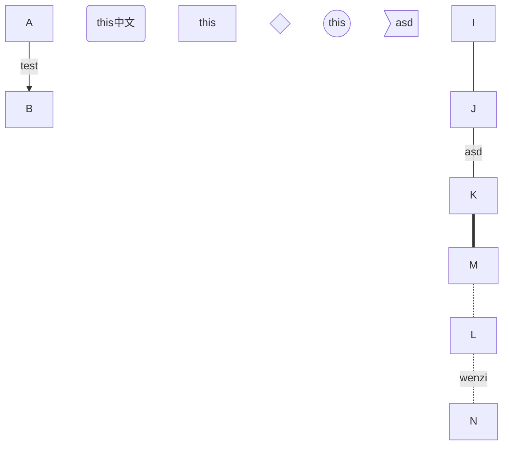

- [ ] [a](http://www.baidu.com "title")
    - [x] b
    
中文
[text](http://www.baidu.com)
[](http://www.baidu.com)
```C
char a = 'c';
int main(void)
{
    return 0;
}
```
# t
## t
### t
#### t
##### t
###### t
normal


normal
-----
normal
***


**bold**
*lean*
***lean & bold***
~~delete~~
>refer
>>refer
----
[link](url "title")
1. order list
1. order list
    1.order list
- ulist
* ulist
    + ulist    

column1|column2|collumn3
 :--|:-:|--:
 first|second|third|


:smile:
😂